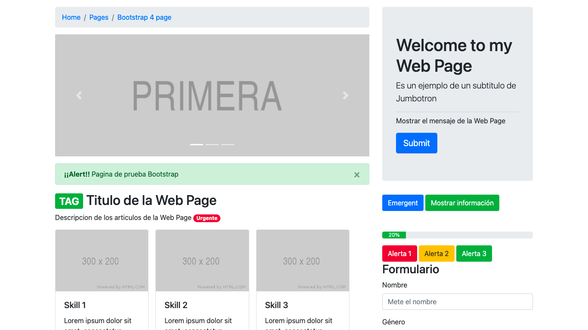

# Bootstrap Template

## Table of contents

- [Overview](#overview)
  - [The challenge](#the-challenge)
  - [Screenshot](#screenshot)
- [My process](#my-process)
  - [Built with](#built-with)
  - [What I learned](#what-i-learned)
  - [Continued development](#continued-development)
- [Author](#author)

## Overview

### The challenge

Users should be able to:

- View the page on any device size
- See an implementation of the bootstrap functions
- View a home page template without redirects.

### Screenshot

## My process

### Built with

- HTML
- CSS
- Bootstrap Framework

### What I learned

In this page I learned mainly to develop a bootstrap logic to make use of its classes to style the labels, I also learned to use the main actions of bootstrap such as breadcrumbs, slider, alerts, budgets, use of cards, pagination and several more styles like Jumbotron and pop-up windows.

### Continued development

Because it is a template with the bootstrap components, in the future an application can be implemented so that each of the components is used correctly.

## Author

Luis David Jimenez Martinez
- Portfolio - [www.luisdavidjm.com](https://www.luisdavidjm.com)
- GitHub - [LuisDavidJM](https://github.com/LuisDavidJM)
